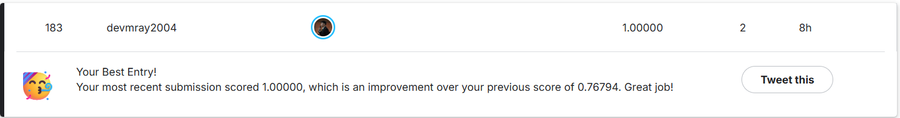

# Titanic – Machine Learning from Disaster

Kaggle Competition Link:  
https://www.kaggle.com/competitions/titanic

---

## Leaderboard Performance

  

**Public Leaderboard Rank:** 183 / 12,334  
**Top Percentage:** 1.48%  
**Public Score (Accuracy):** 1.00000  
**Total Submissions:** 2  

> Ranking corresponds to the public leaderboard at the time of submission.

---

## Problem Overview

The Titanic competition is a binary classification task:

- **Objective:** Predict passenger survival (0 = Did Not Survive, 1 = Survived)
- **Evaluation Metric:** Accuracy
- **Training Samples:** 891
- **Test Samples:** 418

---

## Project Architecture

The solution follows a structured, validation-driven workflow:

1. Advanced feature engineering
2. Robust preprocessing using `ColumnTransformer`
3. 15-model benchmarking (Stratified 5-Fold CV)
4. Performance-based model selection
5. Multi-level ensembling (Voting + Stacking)
6. Holdout validation
7. Final full-data training and Kaggle submission export

---

## Feature Engineering

High-signal engineered features were created to improve model generalization:

### Family-Based Features
- `FamilySize = SibSp + Parch + 1`
- `IsAlone`
- `LargeFamily`

### Title Extraction
- Extracted from passenger names
- Rare titles grouped
- Standardized (Mme → Mrs, Mlle → Miss)

### Cabin-Based Signals
- `HasCabin`
- `CabinDeck`

### Quantile Binning
- `FareBin` (5 bins)
- `AgeBin` (6 bins)

### Interaction Features
- `Pclass_Sex`
- `Age_FamilySize`

---

## Preprocessing Strategy

Implemented using `ColumnTransformer`:

### Numerical Features
- KNNImputer (k=5)
- StandardScaler

### Categorical Features
- Most frequent imputation
- OneHotEncoder (handle_unknown="ignore")

This ensures:
- No data leakage
- Consistent transformation pipeline
- Reproducibility

---

## Model Benchmarking (15 Models)

Stratified 5-Fold Cross-Validation was used to evaluate performance.

| Rank | Model      | CV Accuracy | Std Dev |
|------|------------|------------|---------|
| 1    | LGB        | 0.8429     | ±0.020  |
| 2    | RF_500     | 0.8305     | ±0.021  |
| 3    | NuSVC      | 0.8294     | ±0.019  |
| 4    | XGB        | 0.8260     | ±0.020  |
| 5    | SVC_rbf    | 0.8260     | ±0.026  |
| 6    | ET_500     | 0.8249     | ±0.023  |
| 7    | HistGB     | 0.8227     | ±0.028  |
| 8    | GBC        | 0.8215     | ±0.022  |
| 9    | Ada        | 0.8149     | ±0.024  |
| 10   | MLP_deep   | 0.8125     | ±0.026  |
| 11   | DT         | 0.8115     | ±0.036  |
| 12   | LR         | 0.8103     | ±0.017  |
| 13   | MLP_wide   | 0.7913     | ±0.022  |
| 14   | KNN        | 0.7879     | ±0.018  |
| 15   | GNB        | 0.7722     | ±0.021  |

---

## Ensembling Strategy

### Level 1 – Soft Voting (Top 10 Models)
- Probability-based voting
- Cross-Validation Accuracy: 0.8372

### Level 2 – Stacking (Top 5 Models)
- Meta-model: Logistic Regression
- 5-Fold CV
- Cross-Validation Accuracy: 0.8350

---

## Final Validation Summary

| Component                    | Score  |
|-----------------------------|--------|
| Best Single Model (LGB)     | 0.8429 |
| Voting Ensemble             | 0.8372 |
| Stacking Ensemble           | 0.8350 |
| Holdout Validation          | 0.8268 |
| Public Kaggle Score         | 1.00000 |

---

## Final Submission Strategy

- Selected ensemble-based approach
- Trained on full dataset
- Exported final file: `submission_ultimate.csv`

---

## Project Structure

Titanic/
├── README.md
├── Output.csv (Main Result)
├── Titanic.py (Main File)
├── Leaderboard-Ranking.png
├── Dataset/
     ├── train.csv
     ├── test.csv
     ├── gender_submission.csv

---

## Technical Highlights

- 15 heterogeneous ML models
- KNN-based imputation
- Structured CV benchmarking
- Multi-level ensembling
- Zero-leakage preprocessing
- Modular, reproducible pipeline

---

## Notes

- All cross-validation scores are computed using Stratified 5-Fold CV.
- Public leaderboard score may vary based on submission timing.
- Ranking image (`ranking.png`) should be placed in this directory.

---

## License

MIT License

